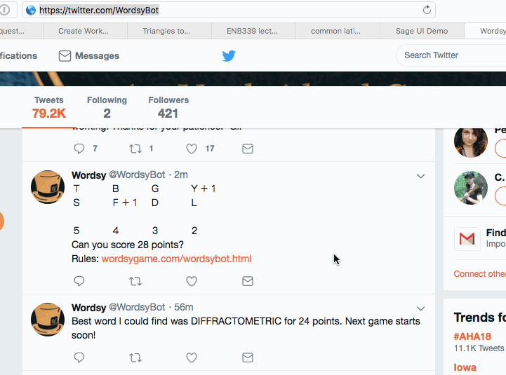

Game is played here: https://twitter.com/WordsyBot

How to use it:

* Modify the code to change the set of word lists
* Copy the board from a tweet
* run `ruby play.rb`
* Paste the board
* Press `Control-D`
* Wait a moment
* Choose your favourite word from the output
* Paste it as a reply to the tweet
* Check your score

Note that their word lists aren't exactly the same, so sometimes it won't accept your word.

